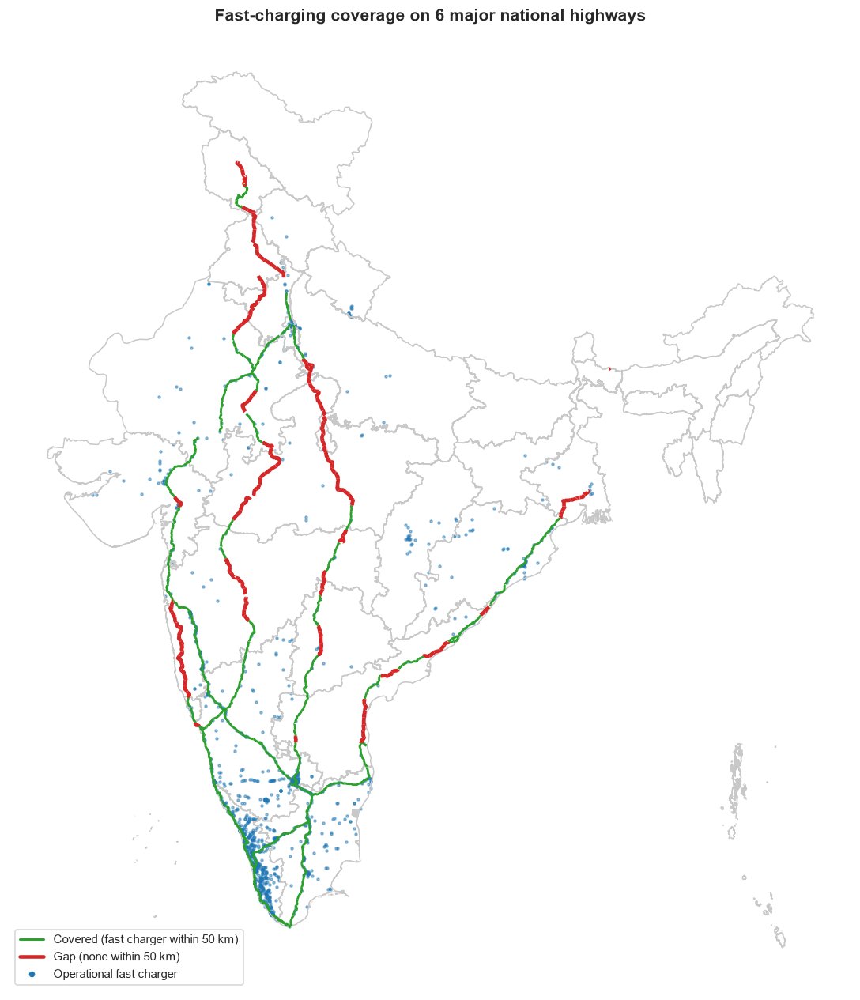
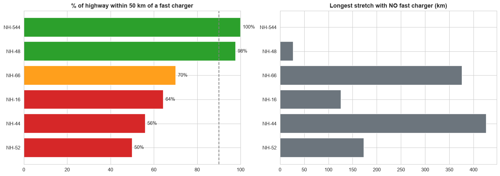
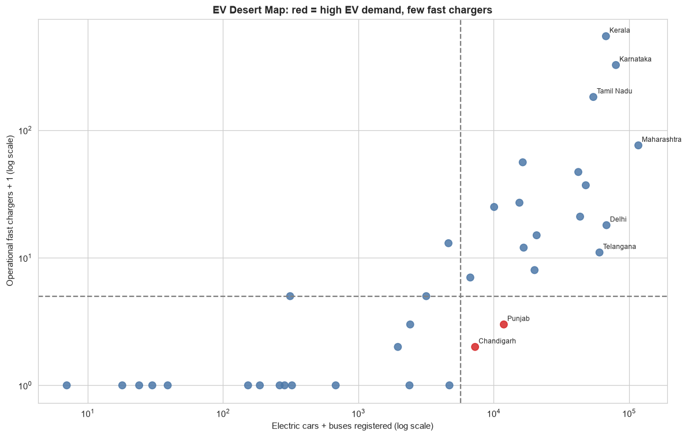
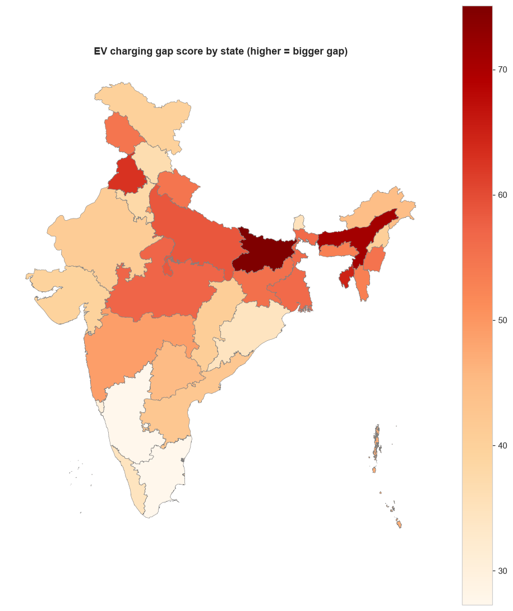

# EV Highway Corridor Reliability Gap Analysis

## Project Title

**EV Highway Corridor Reliability Gap Analysis** 

## Industry Name

**Electric Vehicle (EV) / Transportation & Mobility**

---

## Problem Statement

The growth of electric vehicles in India requires reliable charging infrastructure not only within cities but also along major highway corridors.

This project analyzes EV charging station locations, highway networks, and EV registration data to identify potential charging infrastructure gaps along six major national highways in India.

The objective is to determine whether charging infrastructure is sufficiently distributed along important highway corridors, identify highway stretches where EV drivers may lack nearby fast-charging infrastructure, and examine these gaps in relation to EV adoption across all 36 states and Union Territories.

---

## Proposed Solution / Analysis Questions

The project uses **Python-based data analysis and geospatial analysis** to evaluate EV charging infrastructure along major Indian highways.

The analysis focuses on the following questions:

- How well are major highways covered by fast-charging infrastructure?
- Which highway stretches have no nearby fast charger?
- What are the longest uncovered stretches?
- Does charger count alone accurately represent highway charging coverage?
- How does charging infrastructure compare with EV registrations across states and Union Territories?
- Which states have a higher potential mismatch between EV demand and charging infrastructure?
- How do the results change when different gap distances and fast-charger definitions are used?
- How consistent are the highway ratings under different analytical assumptions?

The project analyzes six target highways:

- NH-44
- NH-48
- NH-16
- NH-66
- NH-544
- NH-52

---

## Dataset Name

The project uses multiple datasets:

1. **EV Registration Data**
   - All EV registrations
   - Electric cars
   - Electric buses

2. **EV Charging Station Data**

3. **National Highway Data**

4. **State and Union Territory Boundary Data**

---

## Dataset Source

### EV Registration Data

**Source:** [Vahan Dashboard](https://vahan.parivahan.gov.in/vahan4dashboard/)

The data covers:

- Calendar years 2017–2026
- ELECTRIC(BOV) and PURE EV
- ACTIVE registration status
- All 36 states and Union Territories

> **Note:** 2026 is a partial year.

### Charging Station Data

**Source:** [Open Charge Map API](https://openchargemap.org/site/develop/api)

The India charging-station data contains **1,979 raw records** before cleaning.

Open Charge Map data is licensed under **CC BY 4.0**. Appropriate attribution is required when reusing the charger data.

### National Highway Data

**Source:** MoRTH via PM GatiShakti, from [India Geodata](https://yashveeeeeeer.github.io/india-geodata/)

The project uses the `National_Highways.parquet` dataset.


### State and Union Territory Boundaries

**Source:** India Geodata

State and Union Territory boundaries are used for assigning charging stations and highway segments to geographic regions.

---

# Tools & Technologies

- Python
- Jupyter Notebook
- NumPy
- Pandas
- GeoPandas
- Shapely
- SciPy
- Scikit-learn
- Matplotlib
- Seaborn

### Coordinate Reference System

**EPSG:7755** is used as the projected CRS for distance and length calculations.

---

# Project Workflow

```
Industry Selection
        ↓
Problem Identification
        ↓
Dataset Collection
        ↓
Data Cleaning
        ↓
Data Transformation
        ↓
Data Analysis
        ↓
Data Visualization
        ↓
Insights
        ↓
Recommendations
```

---

# Data Cleaning

The datasets were cleaned and prepared before performing the analysis.

### Charging Station Data

- Raw records: **1,979**
- Cleaned records: **1,841**
- Operational chargers used in the final analysis: **1,822**
- Fast chargers under the ≥25 kW definition: **1,421**

### Highway Data

- Original records: **10,317**
- Cleaned records: **9,507**

The cleaning process included handling:

- Duplicate records
- Invalid geometries
- Missing values
- Coordinate issues
- Inconsistent state names
- Highway attributes
- Charger operational status

---

# Data Transformation

The project applies several spatial and analytical transformations.

### Fast Charger Definition

The primary definition of a fast charger is:

" Operational charger with maximum power ≥ 25 kW "


The dataset's own fast-charge flag disagreed with the power-based definition for **152 stations**.

Therefore, the primary analysis uses charger power to define fast chargers, while the dataset flag is tested as an alternative during robustness analysis.

### Highway Segmentation

The selected highway network is divided into approximately **25 km segments**.

For each segment:

1. The segment midpoint is calculated.
2. The nearest operational fast charger is identified.
3. Straight-line distance to the nearest fast charger is calculated.
4. The segment is classified as covered or uncovered.

A segment is considered a gap when:

" Distance to nearest fast charger > 50 km "

### Highway Corridor Buffer

For the six selected highways, only chargers within a **5 km corridor buffer** of the corresponding highway are counted for the highway scorecard.

---

# Data Analysis & Visualization

The project performs the following analysis using Python and geospatial techniques.

## 1. EV Registration Analysis

EV registrations are analyzed across:

- States and Union Territories
- Calendar years
- All EVs
- Electric cars
- Electric buses

The total EV registrations in the dataset from 2017 to 2026 are:

**10,377,820**

Cars and buses account for approximately **7%** of the total EV registrations.

---

## 2. Charging Infrastructure Analysis

Charging infrastructure is analyzed using:

- Charger operational status
- Maximum charging power
- Fast-charger classification
- State-level charger distribution
- Charger density

The final analysis contains:

- **1,822 operational chargers**
- **1,421 fast chargers** under the ≥25 kW definition

---

## 3. Highway Coverage Analysis

Six national highways are analyzed:

- NH-44
- NH-48
- NH-16
- NH-66
- NH-544
- NH-52

The analysis calculates:

- Highway length
- Fast chargers within 5 km
- Chargers per 100 km
- Covered highway percentage
- Uncovered highway length
- Longest uncovered stretch
- Highway reliability rating

---

## 4. Highway Gap Analysis

Highway segments are evaluated using a **50 km gap threshold**.

A highway segment is considered uncovered when the nearest fast charger is more than 50 km away.

The analysis identifies:

- Total uncovered highway length
- Longest uncovered stretch
- Highway-level coverage
- State-level contribution to highway gaps

---

## 5. State-Level EV Infrastructure Gap Analysis

A state-level **EV Desert Index** is calculated from three components:

| Component | Weight |
|---|---:|
| EVs per charger | 40% |
| Share of highway in gap | 35% |
| Charger sparsity per area | 25% |

Each component is min-max scaled before applying the weights.

The resulting index ranges from **0 to 100**.

---

## 6. Sensitivity Analysis

The project tests the stability of the results using different assumptions.

### Gap Distance

- 25 km
- 50 km
- 75 km
- 100 km

### Fast-Charger Definition

- ≥22 kW
- ≥25 kW
- ≥50 kW
- Dataset fast-charge flag

### Weighting Schemes

Five alternative weighting schemes are tested for the EV Desert Index.

---

## 7. K-Means Clustering

K-Means clustering with **3 clusters** is used as a supporting analysis to group states based on the analyzed EV and charging-infrastructure characteristics.

---

# Key Insights

1. **10,377,820 EVs** were registered between 2017 and 2026 in the Vahan data used.

2. Only approximately **7%** of the EV registrations are cars or buses, the vehicle categories considered relevant to highway fast-charging analysis.

3. **1,822 operational chargers** were mapped in India, including **1,421 fast chargers** under the ≥25 kW definition.

4. Approximately **98,551 km (60%)** of the mapped road network has no fast charger within 50 km.

5. **NH-544** has the highest coverage among the six selected highways, with **100%** coverage.

6. **NH-48** has **97.7%** coverage and is also classified as **Reliable**.

7. **NH-52** has the lowest coverage among the six selected highways at **50.0%**.

8. The longest uncovered stretch among the selected highways is approximately **427 km on NH-44**.

9. **NH-66** has **243 nearby fast chargers** but still contains a **376 km uncovered stretch**, showing that charger count alone does not describe corridor-level coverage.

10. Maharashtra has the largest uncovered key-highway length at approximately **891 km**, followed by Madhya Pradesh at approximately **796 km**.

11. The highest overall state EV Desert Index scores are observed for **Bihar, Chandigarh, Assam, Tripura, and Punjab**.

12. Highway ratings remain broadly stable under the primary fast-charger definitions, while using a stricter **≥50 kW** definition changes some highway classifications.

---

# Recommendations

Based on the findings of the analysis:

- **Focus on uncovered highway stretches rather than relying only on state-level charger counts.**

- **Prioritize long highway gaps** where fast-charging infrastructure is not available within the defined 50 km threshold.

- **Consider EV demand along with charger availability** when identifying infrastructure priorities.

- **Use corridor-level analysis for infrastructure planning**, since a high number of chargers in a state does not necessarily mean that its major highways are well covered.

- **Validate mapped gaps with current ground-level information**, because Open Charge Map is crowdsourced and may contain incomplete or outdated records.

- **Use multiple charger definitions and gap thresholds** when evaluating infrastructure coverage rather than relying on a single assumption.

- **In future analysis, incorporate road-network driving distance and traffic data** to provide a more realistic assessment of highway charging accessibility.

---

# Highway Coverage Scorecard

| Highway | Length (km) | Fast Chargers Within 5 km | Chargers / 100 km | Covered (%) | Uncovered (km) | Longest Gap (km) | Rating |
|---|---:|---:|---:|---:|---:|---:|---|
| NH-544 | 330.6 | 101 | 30.6 | 100.0 | 0.0 | 0.0 | Reliable |
| NH-48 | 2,542.5 | 191 | 7.5 | 97.7 | 58.2 | 27.1 | Reliable |
| NH-66 | 1,646.0 | 243 | 14.8 | 70.1 | 491.8 | 376.1 | Patchy |
| NH-16 | 1,711.8 | 38 | 2.2 | 64.4 | 609.0 | 126.2 | Poor |
| NH-44 | 3,558.1 | 186 | 5.2 | 56.0 | 1,566.8 | 426.6 | Poor |
| NH-52 | 2,228.7 | 19 | 0.9 | 50.0 | 1,114.7 | 173.4 | Poor |

### Highway Rating Criteria

- **Reliable:** More than 90% covered
- **Patchy:** 70%–90% covered
- **Poor:** 70% or below

---

# Visualization Screenshots

The following are the actual visualizations provided for the project.

## Fast-Charging Coverage on 6 Highways



## Highway Scorecard



## EV Desert Quadrant



## State Gap Score Map



> Additional project visualizations are available in the `outputs/figures/` folder.

---

# Project Folder Structure

EV_Highway_Corridor_Reliability_Gap_Analysis/
│
├── README.md
│
├── data/
│   │
│   ├── Raw datasets/
│   │   └── Source datasets
│   │
│   └── Cleaned datasets/
│       ├── states_clean.parquet
│       ├── highways_clean.geojson
│       ├── Ev_registration_all_cleaned.csv
│       ├── Ev_registration_car_cleaned.csv
│       ├── Ev_registration_bus_cleaned.csv
│       └── Ev_chargers_cleaned.csv
│
├── notebooks/
│   ├── Dataset cleaning notebooks
│   └── Final analysis notebook
│
├── outputs/
│   │
│   ├── figures/
│   │   ├── 10_gap_map_6_highways.png
│   │   ├── 09_highway_scorecard.png
│   │   ├── 06_ev_desert_quadrant.png
│   │   ├── 18_gap_score_map.png
│   │   └── Other project figures
│   │
│   └── tables/
│       ├── highway_scorecard.csv
│       ├── state_gap_master.csv
│       ├── state_priority_6_highways.csv
│       ├── highway_rating_by_definition.csv
│       └── GeoJSON analysis outputs
│
├── docs/
│   └── PROJECT_REPORT.md
│
└── requirements.txt

---

# Limitations

- **Open Charge Map is crowdsourced**, so charger records may be incomplete or outdated.
- Operational status represents a **snapshot** and does not measure real-time charger uptime.
- Highway gaps are based on **straight-line distance**, not actual driving distance.
- The highway dataset was updated on **30-06-2022**.
- The analysis does not filter the highway data by current road status.
- The **5 km corridor buffer**, **25 km segmentation**, **50 km gap threshold**, and **≥25 kW fast-charger definition** are project-specific analytical choices.
- Vahan registration data is available at the state level and does not directly represent highway traffic or route-level EV demand.
- **2026 registration data is a partial year.**
- The EV Desert Index weights are analytical assumptions and state rankings can change under different weighting schemes.

---

# Future Work

- Repeat the charger data collection over time to study infrastructure changes.
- Use driving distance along the road network instead of straight-line distance.
- Add traffic volume and highway vehicle-flow data.
- Expand the analysis beyond the six selected highways.
- Compare Open Charge Map data with official state-wise charger counts.
- Estimate the minimum number of new charging locations required to reduce highway gaps below a target distance.
- Build an interactive dashboard or web map for route-level exploration.
- Incorporate charger reliability and uptime information when available.

---

# Project Report

Detailed methodology, analysis, results, visualizations, and sensitivity analysis are available in:

```text
docs/PROJECT_REPORT.md
```

---

# Acknowledgements

This project uses publicly available data and resources from:

- **Open Charge Map contributors** — Charging station data
- **Ministry of Road Transport and Highways** — Vahan registration data
- **MoRTH / PM GatiShakti** — National highway data
- **India Geodata project** — Highway and state geospatial datasets

Open Charge Map data is licensed under **CC BY 4.0**. Appropriate attribution should be provided when reusing the charger data.

---

# Author

- **Name:** Inbavathi Murugan
- **Student ID:** AF05309783
- **Organization:** Anudip Foundation
- **Course:** AIML
- **Batch Code:** ANP-D7444

---

# Conclusion

This project demonstrates why **charger count alone is not sufficient to evaluate EV highway infrastructure**.

By combining EV registration data, charging-station locations, highway geometry, spatial segmentation, and gap analysis, the project provides a **corridor-level perspective** of EV charging accessibility.

The analysis shifts the focus from:

> **"How many chargers does a state have?"**

to:

> **"Can an EV driver actually travel along the highway and find a fast charger when needed?"**